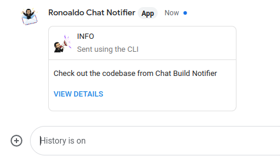
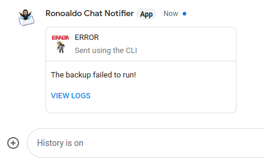

# Google Chat Notifier

Simple Google Chat utilities for automated notifications.

# Install

As of now, I don't provide any pre-built binaries but you can
easily install with Go:

```
go install github.com/ronoaldo/chat-build-notifier/cmd/google-chat@latest
```

This will put the program `google-chat` in your `$GOPATH/bin` folder.

# Setup

Create a Google Chat space and add a new webhook. Grab the webhook URL and
store it in an environment variable, like:

```
export CHAT_WEBHOOK="https://chat.googleapis.com/v1/spaces/ABCDeFGh97I/messages?key=NoThisisNotAKEY..."
```

Alternatively, you can set an alias/script and pass the webhook URL with the `-webhook` option:

```
alias google-chat='google-chat -webhook="https://chat.googleapi..."
```

This could allow you to have different aliases for different spaces or bots.

# Usage

## Send a basic text message

After you have the environment variable set, you can start sending messages
like this:

```
google-chat -message "Testing chat webhook."
```

And they should show up in the space, like this:


## Send a message with an action link

Sometimes you also want to send a notification link with the message.
This can be done this way:

```
google-chat \
    -message "Check out the codebase from Chat Build Notifier" \
    -link https://github.com/ronoaldo/chat-build-notifier
```



## Send an error message with a link

You can change the title with the `-type` parameter as well as change how the
code 

```
google-chat \
    -type error \
    -message "The backup failed to run!" \
    -link "https://example.com/logs/backup.log" \
    -link-name "View logs"
```




## All options

```
$ google-chat --help
Usage of google-chat:
  -link URL
        An optional link URL for the user to click
  -link-name NAME
        The action link NAME. (default "View details")
  -message MESSAGE
        The MESSAGE to send via webhook
  -type TYPE
        The TYPE of the message to send: [yes, info, error, warning] (default "info")
  -webhook URL
        The webtook URL to send the message to. If not provided, will try the environment var CHAT_WEBHOOK
```